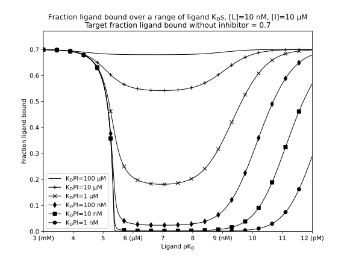

# competition-label-affinity
An investigation into the impact of labelled ligand affinity in competition experiments.  Code accompanies the paper "Optimum ligand affinity for competition-based primary screens" by Shave et. al.

## Requirements
Code developed using python 3.7.1 but should work with any Python version 3.6 or greater. The following packages are also required
- Matplotlib (2.x)
- Numpy (1.15.x)
- mpmath (1.1.0)

## Program definitions
### 01_plot_protein_needed_vs_ligand_kd.py
 - Plot ligand pKD vs conc protein needed to achieve desired (default = .7) fraction ligand bound.
### 01_plot_singal_vs_ligand_kd_fixed_inhibitor.py
 - Plot ligand pKD vs fraction ligand bound
### 01_simulate_competition_experiment.py
 - Simultate a simple single point from a competition experiment.

### 02_inhibitorKD_vs_fractionBound.py
 - Simulate inhibitor pKD vs fraction ligand bound

### 02_inhibitorKD_vs_fractionBound_animation.py
- Generate animation of inhibitor pKD vs fraction ligand bound over a range of ligand pKDs in the animation.
### 02_inhibitorKD_vs_fractionBound_interactive.py
- Interactive plot of inhibitor pKD vs fraction ligand bound over a range of changable ligand pKDs.
### 02_ligandKD_vs_fractionBound.py
 - Plot ligand pKD vs fraction ligand bound in the presence of a fixed concentration of inhibitor with fixed KD.
### 02_ligandKD_vs_fractionBound_animation.py
 - Generate animation for ligand pKD vs fraction ligand bound, varying ligand KD over time.

### 02_ligandKD_vs_fractionBound_interactive.py
 - Interactive plot of ligand pKD vs fraction ligand bound, varying inhibitor KD.

### 03_ligandKD_vs_fractionBoundAsPercentSignalReduction.py
- Plot ligand pKD vs percent signal reduction in the presence of a fixed concentration of inhibitor with fixed KD.

### 04_missed_inhibitors.py
- Simulate real world example whereby inhibitors would be missed in a primary screen using high affinity ligands.

### 05_KDPL_vs_FLB_VaryingTargetFLB.py
- Plot pKD of ligand vs fraction ligand bound, varying the target fraction ligand bound from the default 0.7.

### 06_KDPL_vs_FLB_VaryingL0.py
- Plot pKD of ligand vs fraction ligand bound, varying the amount of ligand present.

### 07_KDPL_vs_FLB_VaryingI0.py
- Plot pKD of ligand vs fraction ligand bound, varying the amount of inhibitor present.

### 08_HuangPlot.py
- Reproduce the Huang plot *(Huang, X., Fluorescence polarization competition assay: the range of resolvable inhibitor potency is limited by the affinity of the fluorescent ligand. Journal of biomolecular screening 2003, 8 (1), 34-38.)*
